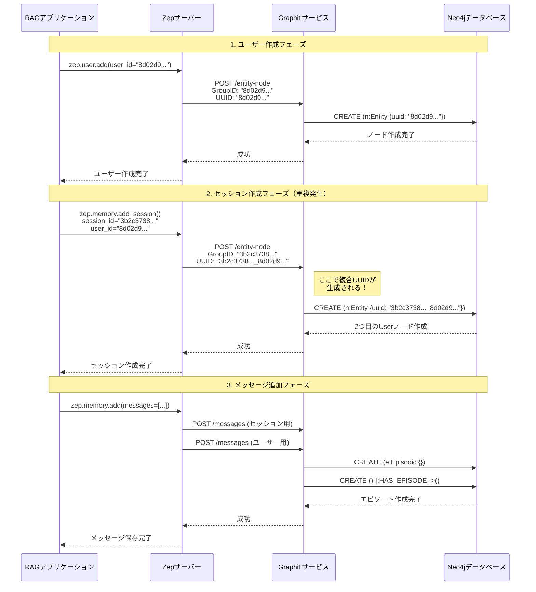

# Graphitiの動作フローとシーケンス図

## 概要

このドキュメントでは、ZepからGraphitiへのAPI呼び出しフローと、Neo4jでのデータ構造を視覚的に説明します。

## シーケンス図：ユーザー作成からメッセージ追加まで



## GraphitiのAPIエンドポイント詳細

### 1. エンティティノード作成：POST /entity-node

**リクエスト形式：**
```json
{
    "group_id": "文字列（グループ識別子）",
    "uuid": "文字列（エンティティの一意識別子）",
    "name": "文字列（エンティティ名）",
    "summary": "文字列（エンティティの説明）"
}
```

**処理フロー：**
1. リクエスト検証
2. エンベディング生成（名前から）
3. Neo4jにエンティティノード作成
4. インデックス更新

### 2. メッセージ追加：POST /messages

**リクエスト形式：**
```json
[
    {
        "uuid": "文字列（メッセージUUID）",
        "group_id": "文字列（グループID）",
        "content": "文字列（メッセージ内容）",
        "role": "文字列（ロール）",
        "created_at": "日時"
    }
]
```

**処理フロー：**
1. エピソードノード作成
2. エンティティ抽出（LLM使用）
3. 関係性の構築
4. 既存エンティティとのリンク

### 3. メモリ取得：POST /get-memory

**リクエスト形式：**
```json
{
    "group_id": "文字列",
    "query": "文字列（検索クエリ）"
}
```

**処理フロー：**
1. クエリのエンベディング生成
2. 関連エピソード検索
3. ファクト抽出
4. 結果の構造化

## Neo4jのデータ構造

### 現在の問題のある構造

```
グラフ構造：
┌─────────────────────────────┐
│ Entity: User                │
│ uuid: "8d02d9..."          │
│ group_id: "8d02d9..."      │
│ name: "User  "             │
└─────────────────────────────┘

┌─────────────────────────────┐
│ Entity: User                │<--- 重複！
│ uuid: "3b2c3738..._8d02d9."│
│ group_id: "3b2c3738..."    │
│ name: "User  "             │
└──────────┬──────────────────┘
           │
           │ HAS_EPISODE
           ↓
┌─────────────────────────────┐
│ Episodic: Message          │
│ uuid: "msg-uuid-1"         │
│ content: "質問内容..."      │
└─────────────────────────────┘
```

### 理想的な構造

```
グラフ構造：
┌─────────────────────────────┐
│ Entity: User                │
│ uuid: "8d02d9..."          │
│ group_id: "8d02d9..."      │
│ name: "User  "             │
└──────────┬──────────────────┘
           │
           │ HAS_EPISODE
           ↓
┌─────────────────────────────┐
│ Episodic: Message          │
│ uuid: "msg-uuid-1"         │
│ content: "質問内容..."      │
└─────────────────────────────┘
```

## Graphiti内部の処理詳細

### エンティティ作成時の内部処理

```python
# Graphitiのエンティティ作成処理（疑似コード）
def create_entity_node(request):
    # 1. 既存エンティティの確認
    existing = neo4j.query(
        "MATCH (n:Entity {uuid: $uuid}) RETURN n",
        uuid=request.uuid
    )
    
    if existing:
        # 既存の場合は更新
        return update_entity(existing, request)
    
    # 2. 新規作成
    node = neo4j.create(
        "CREATE (n:Entity {" +
        "  uuid: $uuid," +
        "  group_id: $group_id," +
        "  name: $name," +
        "  summary: $summary," +
        "  created_at: datetime()" +
        "}) RETURN n",
        **request
    )
    
    # 3. エンベディング生成と保存
    embedding = generate_embedding(request.name)
    neo4j.update(
        "MATCH (n:Entity {uuid: $uuid}) " +
        "SET n.name_embedding = $embedding",
        uuid=request.uuid,
        embedding=embedding
    )
    
    return node
```

### メッセージ処理時のエンティティ抽出

```python
# エンティティ抽出とリンク処理（疑似コード）
def process_message(message):
    # 1. エピソードノード作成
    episode = create_episode_node(message)
    
    # 2. LLMでエンティティ抽出
    entities = llm.extract_entities(message.content)
    
    # 3. 各エンティティの処理
    for entity in entities:
        # 既存エンティティの検索
        existing = find_similar_entity(entity, message.group_id)
        
        if existing:
            # 既存エンティティとリンク
            create_relationship(episode, existing, "MENTIONS")
        else:
            # 新規エンティティ作成
            new_entity = create_entity_node({
                "uuid": generate_uuid(),
                "group_id": message.group_id,
                "name": entity.name,
                "summary": entity.description
            })
            create_relationship(episode, new_entity, "MENTIONS")
```

## データフローの要約

| フェーズ | Zep呼び出し | Graphiti API | 作成されるノード | UUID形式 |
|---------|-------------|--------------|-----------------|-----------|
| ユーザー作成 | `zep.user.add()` | POST /entity-node | Entity (User) | user_id |
| セッション作成 | `zep.memory.add_session()` | POST /entity-node | Entity (User) - 重複 | session_id + "_" + user_id |
| メッセージ追加 | `zep.memory.add()` | POST /messages | Episodic | group_id + "-" + message_uuid |

## 問題の影響範囲

### 1. ストレージへの影響
- ユーザー数 × セッション数のエンティティが作成される
- 同じ名前とサマリーを持つノードが複数存在

### 2. クエリパフォーマンスへの影響
- ユーザー関連の検索で複数のノードを考慮する必要
- インデックスの効率が低下

### 3. 知識グラフの整合性
- 同一ユーザーの知識が複数のノードに分散
- クロスセッション分析が複雑化

## まとめ

Graphitiの動作フローを分析した結果、重複Userエンティティの作成は、セッション作成時に生成される複合UUID（`session_id + "_" + user_id`）が原因であることが明確になりました。この問題は、Zep側でUUID生成ロジックを統一することで解決可能です。