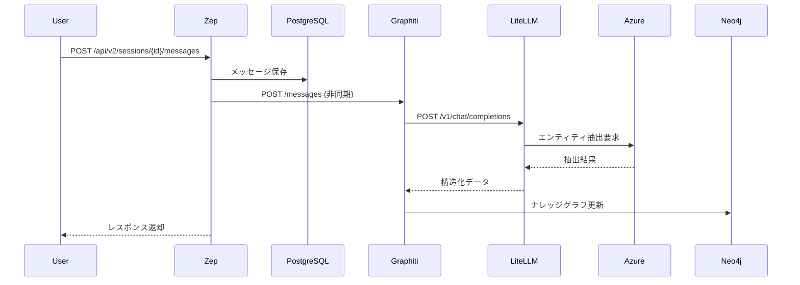
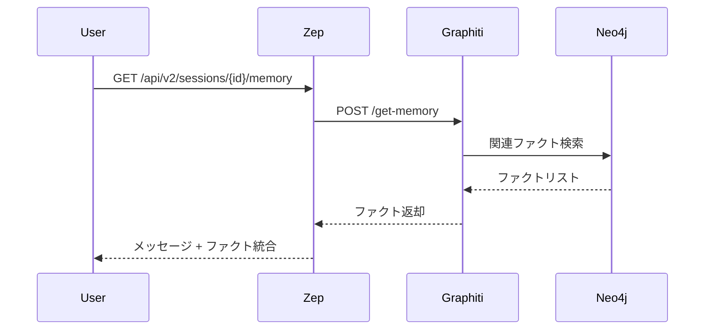

# Zep to Graphiti Communication

## 概要

ZepはGraphitiサービスとHTTP通信を行い、会話データからナレッジグラフを構築・検索する機能を提供します。GraphitiはLLMを使用してメッセージからエンティティと関係性を抽出し、Neo4jデータベースに時系列ナレッジグラフとして保存します。

## サービス構成

### Docker環境での配置
- **Zep**: メインAPIサーバー (port 8000)
- **Graphiti**: ナレッジグラフサービス (port 8003)
- **Neo4j**: グラフデータベース (port 7474/7687)
- **LiteLLM Proxy**: OpenAI互換プロキシ (port 4000)

### 依存関係
```
Zep → Graphiti → Neo4j
      ↓
   LiteLLM Proxy → Azure OpenAI
```

## HTTPエンドポイント

Zepは `http://graphiti:8003` に以下のリクエストを送信します：

| HTTP Method | Endpoint | 用途 | タイミング |
|-------------|----------|------|---------|
| POST | `/messages` | メッセージ投入・ナレッジグラフ構築 | 新メッセージ追加時 |
| POST | `/get-memory` | 関連ファクト取得 | メモリ検索時 |
| POST | `/search` | ファクト検索 | メモリ検索実行時 |
| POST | `/entity-node` | エンティティノード追加 | 明示的エンティティ追加時 |
| GET | `/entity-edge/{uuid}` | 特定ファクト取得 | ファクト詳細取得時 |
| DELETE | `/entity-edge/{uuid}` | ファクト削除 | データ削除時 |
| DELETE | `/group/{groupID}` | グループ削除 | 会話グループ削除時 |
| DELETE | `/episode/{messageUUID}` | メッセージ削除 | 特定メッセージ削除時 |

## リクエスト/レスポンス形式

### 1. メッセージ投入 (`POST /messages`)

**リクエスト例:**
```json
{
  "group_id": "session_123",
  "messages": [
    {
      "uuid": "msg_456",
      "role": "user", 
      "role_type": "human",
      "content": "私の名前は田中です。東京に住んでいます。"
    },
    {
      "uuid": "msg_789",
      "role": "assistant",
      "role_type": "ai", 
      "content": "田中さん、東京にお住まいなんですね。"
    }
  ]
}
```

**処理内容:**
- GraphitiがLLMを使用してメッセージからエンティティを抽出
- 「田中」「東京」「住んでいる」などの情報をナレッジグラフに追加
- Neo4jデータベースに時系列グラフとして保存

### 2. メモリ取得 (`POST /get-memory`)

**リクエスト例:**
```json
{
  "group_id": "session_123",
  "max_facts": 10,
  "center_node_uuid": null,
  "messages": [
    {
      "uuid": "msg_latest",
      "role": "user",
      "content": "私の住所を覚えていますか？"
    }
  ]
}
```

**レスポンス例:**
```json
{
  "facts": [
    {
      "uuid": "fact_001",
      "subject": "田中",
      "predicate": "住んでいる",
      "object": "東京",
      "timestamp": "2025-06-21T06:40:00Z"
    }
  ]
}
```

### 3. ファクト検索 (`POST /search`)

**リクエスト例:**
```json
{
  "group_ids": ["session_123", "user_456"],
  "query": "田中の住所",
  "max_facts": 5
}
```

## データフロー

### 新メッセージ追加時の処理フロー



### メモリ取得時の処理フロー



## HTTP通信設定

### クライアント設定
- **タイムアウト**: 5秒
- **リトライ**: 最大3回
- **Content-Type**: `application/json`
- **認証**: なし（内部サービス通信）

### エラーハンドリング
- 400エラーはリトライしない（不正リクエスト）
- 500エラー系はリトライ実行
- OpenTelemetryによる監視・トレース

## Goコード例

```go
// メッセージをGraphitiに送信
func (dao *MemoryStoreDAO) putMemory(
    ctx context.Context,
    messages []models.Message,
    sessionID string,
    userID *string,
) error {
    // セッションレベルのナレッジグラフ更新
    err := dao.sendToGraphiti(ctx, sessionID, messages)
    
    // ユーザーレベルのナレッジグラフ更新（オプション）
    if userID != nil {
        err = dao.sendToGraphiti(ctx, *userID, messages)
    }
    
    return err
}

// HTTPリクエスト実行
func (dao *MemoryStoreDAO) sendToGraphiti(
    ctx context.Context,
    groupID string,
    messages []models.Message,
) error {
    payload := PutMemoryRequest{
        GroupId:  groupID,
        Messages: convertMessages(messages),
    }
    
    // http://graphiti:8003/messages にPOST
    resp, err := dao.client.R().
        SetContext(ctx).
        SetBody(payload).
        Post("/messages")
        
    return handleResponse(resp, err)
}
```

## ナレッジグラフの構築プロセス

### 1. エンティティ抽出
- ユーザーメッセージから人物、場所、概念などを識別
- LLM（gpt-4o-mini）を使用して構造化データに変換

### 2. 関係性の特定
- エンティティ間の関係（住んでいる、働いている、知っているなど）を抽出
- 時系列情報と組み合わせて保存

### 3. グラフ更新
- 新しい情報は既存のグラフに統合
- 古い情報は無効化され、新しい情報で更新
- 矛盾する情報は時系列で管理

## トラブルシューティング

### よくあるエラー

1. **500 Internal Server Error at /entity-node**
   - 原因: GraphitiからLiteLLM/Azure OpenAIへの接続失敗
   - 対策: LiteLLMプロキシの起動確認とAzure OpenAI認証情報の確認

2. **Connection timeout**
   - 原因: Graphitiサービスが応答しない
   - 対策: Graphitiコンテナの健康状態とNeo4j接続の確認

3. **Authentication errors**
   - 原因: Azure OpenAI APIキーまたはエンドポイントの問題
   - 対策: LiteLLM設定ファイルとAzure OpenAIリソースの確認

### ログの読み方
```
zep-1            | POST /api/v2/users -> Zepへのユーザー作成リクエスト
graphiti-1       | POST /entity-node -> Graphitiでのエンティティノード作成
graphiti-1       | ERROR: Exception in ASGI application -> Graphiti内部エラー
```

この通信パターンにより、ZepはGraphitiの高度なナレッジグラフ機能を活用して、AI エージェントに持続的な記憶と学習能力を提供します。